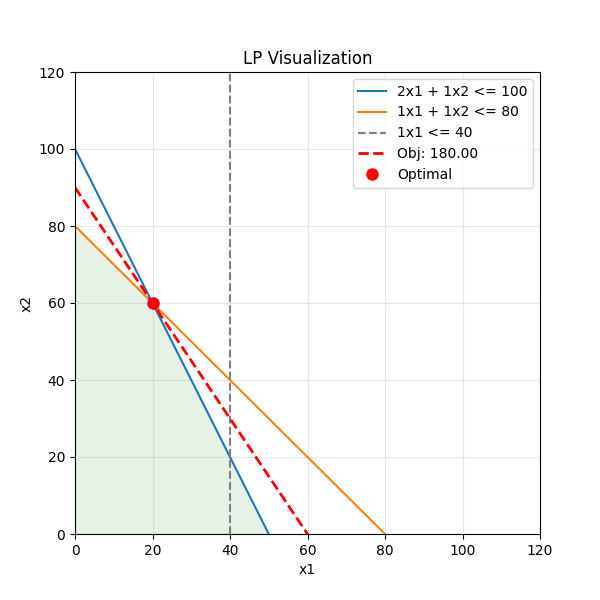
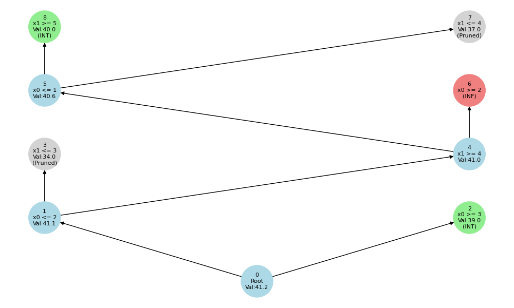
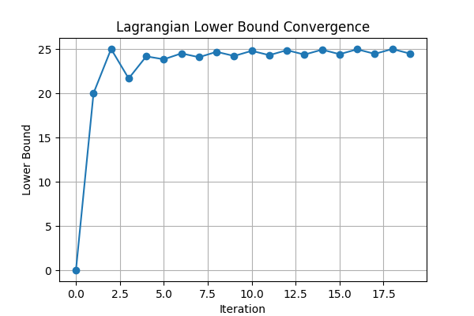
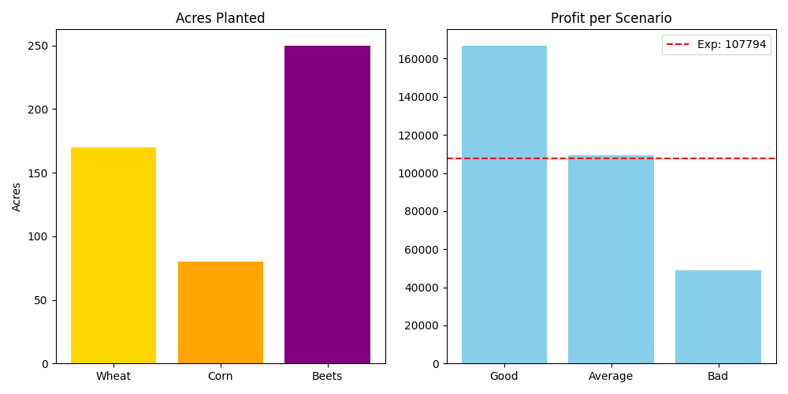

# optimax: Comprehensive Optimization Toolkit


optimax is a comprehensive optimization toolkit designed for the **[SF2812 Applied Linear Optimization](https://www.kth.se/student/kurser/kurs/SF2812?lang=en)** course at KTH. It provides a web-based interface to visualize and solve problems covering the core syllabus topics, including Linear Programming, Integer Programming, Column Generation, Lagrangian Relaxation, and Stochastic Programming.

## Syllabus Coverage

This project implements solvers and visualizations for the following course modules:

### 1. Linear Programming (Simplex/Interior Point)
*   **Module**: `api/solvers/lp.py`
*   **Features**: Solves LP problems using `scipy.optimize.linprog` (Highs method, which includes Simplex/Interior Point). Visualizes 2D feasible regions and objective functions.

    

### 2. Integer Programming (Branch-and-Bound)
*   **Module**: `api/solvers/ip.py`
*   **Features**: Custom Branch-and-Bound implementation for integer programming. Visualizes the search tree, showing branching decisions, bounds, and pruning.

    

### 3. Decomposition & Column Generation
*   **Module**: `api/solvers/colgen.py`
*   **Features**: Solves the Cutting Stock Problem using Column Generation. Iteratively solves the Master Problem (LP) and Subproblem (Knapsack) to generate improving patterns.

### 4. Lagrangian Relaxation
*   **Module**: `api/solvers/lagrangian.py`
*   **Features**: Solves the Generalized Assignment Problem (GAP) using Lagrangian Relaxation. Visualizes the convergence of the Lower Bound using subgradient optimization.

    

### 5. Stochastic Programming
*   **Module**: `api/solvers/stochastic.py`
*   **Features**: Solves the Two-Stage Stochastic Farmer's Problem (Deterministic Equivalent). Visualizes the optimal first-stage decision (planting) and second-stage profit distribution across scenarios.

    

## Tech Stack

*   **Backend**: Python (FastAPI, Scipy, Numpy, Pulp, NetworkX, Matplotlib)
*   **Frontend**: React (Vite)
*   **Deployment**: Vercel (Serverless Python Functions)

## Installation & Running Locally

1.  **Clone the repository**:
    ```bash
    git clone https://github.com/dhruvhaldar/optimax.git
    cd optimax
    ```

2.  **Create and Activate Virtual Environment**:
    *   **Windows**:
        ```bash
        python -m venv venv
        .\venv\Scripts\activate
        ```
    *   **macOS/Linux**:
        ```bash
        python -m venv venv
        source venv/bin/activate
        ```

3.  **Install Backend Dependencies**:
    ```bash
    pip install -r requirements.txt
    ```

4.  **Run the API Server**:
    ```bash
    python -m uvicorn api.index:app --reload
    ```
    The API will be available at `http://localhost:8000/api`.

5.  **Run the Frontend**:
    ```bash
    cd frontend
    npm install
    npm run dev
    ```
    The frontend will run at `http://localhost:5173`.

## Deployment

This project is configured for deployment on **Vercel**.
The `vercel.json` file handles routing for the FastAPI backend (`api/index.py`) and the static React frontend.

## License

MIT License. See [LICENSE](LICENSE) for details.
